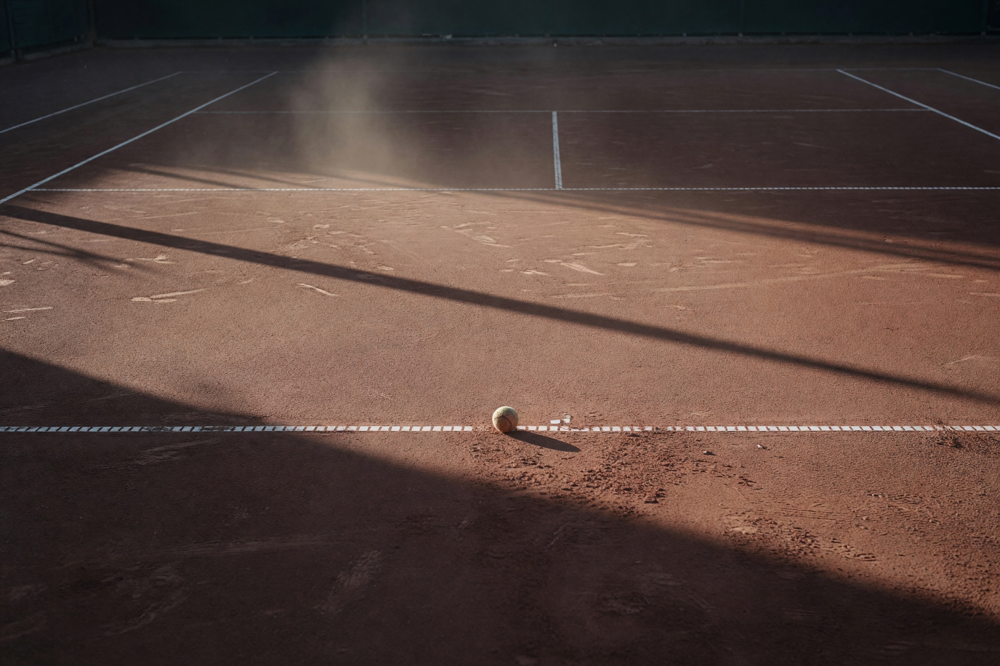
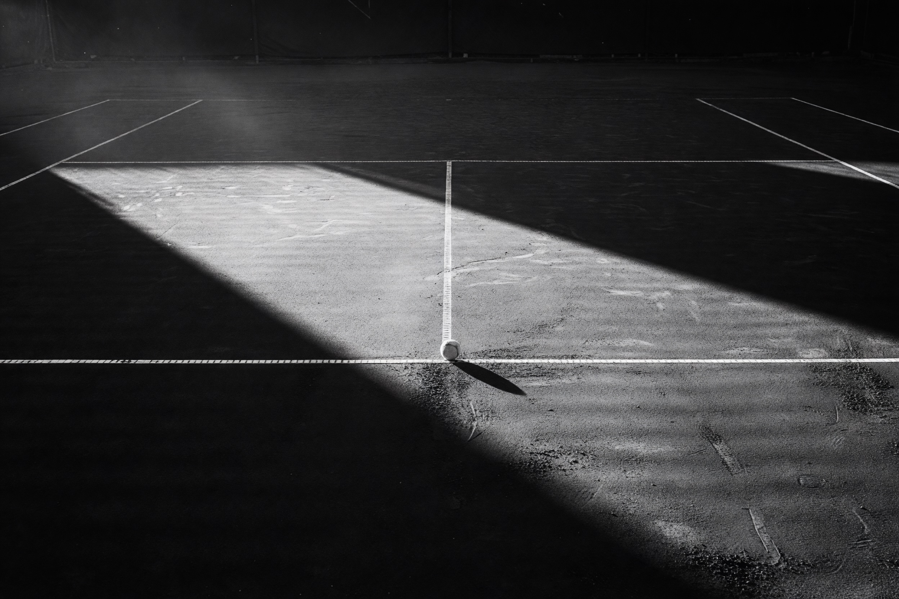
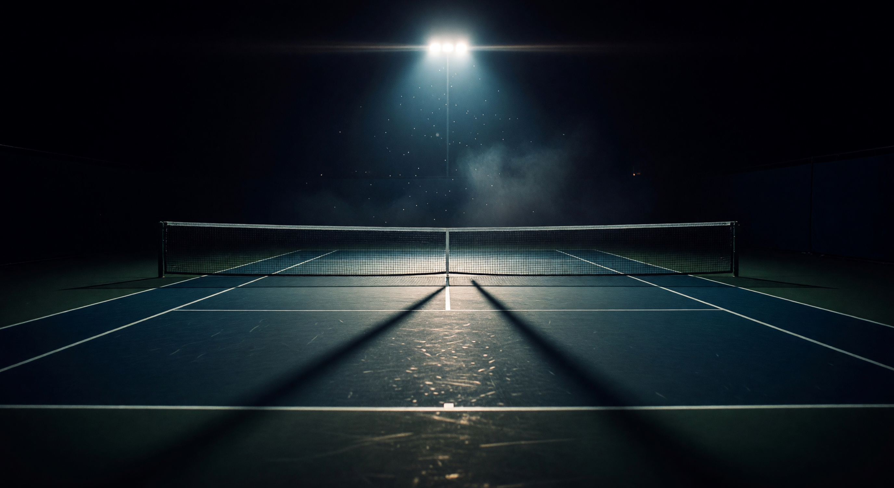
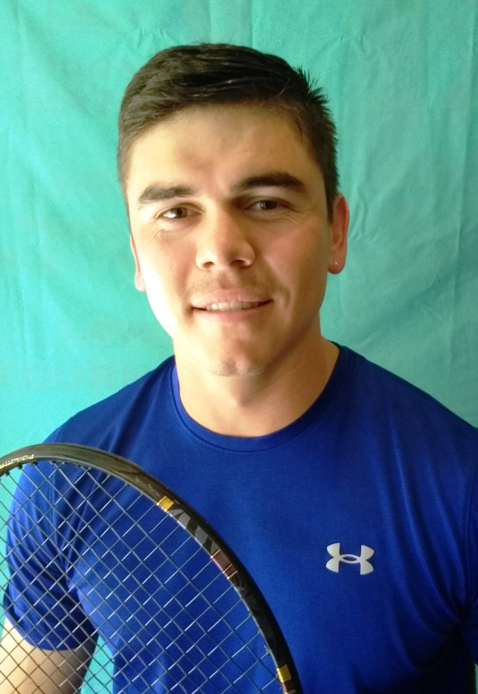

# Image Generation Log — Rodrigo Echavarría

---

### #1 — clay-court-warm.jpg (Grok, warm-toned, repurposed for Direction C)

- **Timestamp**: 2026-05-13 10:07
- **Tier**: 1 | **API**: Grok Standard 2K | **Cost**: $0.02
- **Exec Time**: 6s
- **Slot**: Direction C (Heredad) — right-side hero atmospheric image, also surfaces on selector page card C
- **Prompt**: "Black-and-white documentary photograph of an empty European clay court at last light. Single tennis ball resting near the baseline, long diagonal shadow stretching across the court surface. Soft late-afternoon side-light raking across the terracotta dust, deep silver shadows in the foreground, faded chalk lines barely visible. Shot from a low angle at net height looking down the baseline, 35mm film grain, high contrast, soft atmospheric haze. Editorial New York Times Magazine sports profile mood, quiet, reverent, no people."
- **Claude Review**: Use Case 9/10 (perfect for warm heritage section) | Prompt Accuracy 6/10 (came back warm sepia instead of B&W)
- **Grok QA Review**: Technical 9/10 | Prompt Accuracy 6/10 | Issues: "warm terracotta/sepia tones instead of requested B&W — the only notable deviation. All else clean (composition, ball placement, shadow physics, no artifacts)."
- **Attempts**: 1/2
- **Status**: ✓ Used (for Direction C — warm-toned outcome was actually a better fit for the heritage direction than true B&W would have been)
- **Notes**: Original prompt was for Direction A. Grok ignored "absolutely B&W" and rendered in warm sepia. Repurposed for Heredad direction where warm tones are exactly the brand DNA. Direction A then got a fresh B&W attempt (see #2 below).

---

### #2 — clay-court-bw.jpg (Grok, true B&W for Direction A)

- **Timestamp**: 2026-05-13 10:09
- **Tier**: 1 | **API**: Grok Standard 2K | **Cost**: $0.02
- **Exec Time**: 5s
- **Slot**: Direction A (The Feature) — full-width atmospheric break between Numbers and Training sections ("Plate 01")
- **Prompt**: "Pure monochrome black-and-white silver-gelatin photograph, no color at all, grayscale only. An empty clay tennis court at last light, rendered in dramatic high-contrast black-and-white only with deep blacks and luminous whites. Single tennis ball at the baseline tape, long diagonal shadow stretching across the dusty court surface, faded chalk lines barely visible in the haze. Shot low at net height looking down the baseline, 35mm Tri-X film grain, deep silver blacks, atmospheric mist. New York Times Magazine sports profile editorial photography, somber and reverent, no people, no color tint, ABSOLUTELY BLACK AND WHITE ONLY."
- **Claude Review**: Use Case 9/10 | Prompt Accuracy 9/10
- **Grok QA Review**: Technical 7/10 | Prompt Accuracy 6/10 | Issues: "Court surface reads as hard court (smooth, painted lines) rather than clay (granular dust, taped lines) — significant prompt deviation. Lighting shaft is unnaturally clean/triangular. Grain pattern slightly digital in deep shadows. No object clipping, no warped text, no physics violations otherwise."
- **Attempts**: 1/2
- **Status**: ✓ Used (Grok's "hard court not clay" critique is fair, but the visual works beautifully for the editorial atmospheric — surface ambiguity isn't a problem for a mood plate)
- **Notes**: Strong editorial mood, dramatic raking sidelight, single ball on the line. Exactly the NYT Mag plate vibe wanted.

---

### #3 — court-night.jpg (Grok, cinematic night for Direction B)

- **Timestamp**: 2026-05-13 10:11
- **Tier**: 1 | **API**: Grok Standard 2K | **Cost**: $0.02
- **Exec Time**: 8s
- **Slot**: Direction B (The Operator) — full-bleed hero background; also reused dimmed behind the pull-quote section; cropped for selector page card B and OG images for index + Direction B
- **Prompt**: "Cinematic wide-angle photograph of an indoor hard tennis court at night, single intense stadium floodlight pouring down from above, brilliant white-hot beam carving through deep velvet black shadows. Court playing surface dark teal blue with crisp white painted lines glowing in the floodlight, net casting long deep shadow, atmospheric haze and dust motes catching the light beams. Shot from low rear-court angle looking toward the far baseline, 35mm anamorphic cinema lens, dramatic chiaroscuro lighting, deep navy and warm tungsten contrast, completely empty, no people, no logos, Babolat advertising mood, Wilson Pro Staff aesthetic, mysterious and powerful."
- **Claude Review**: Use Case 10/10 | Prompt Accuracy 9/10
- **Grok QA Review**: Technical 8/10 | Prompt Accuracy 8/10 | Issues: "Light source is 4-bulb fixture rather than single. Lighting reads cool blue-white instead of requested 'tungsten' warm. Minor texture repetition in foreground court surface. Otherwise excellent — empty court, correct net+lines, dramatic god-ray, proper rear-court anamorphic angle."
- **Attempts**: 1/2
- **Status**: ✓ Used
- **Notes**: Best of the three by a comfortable margin. Sells the cinematic-pro-sport mood instantly. The "4 bulbs not 1" deviation isn't visible at any reasonable scale.

---

### Portrait — rodrigo-portrait-original.jpg (NOT generated — sourced from CDN)

- **Timestamp**: 2026-05-13 10:03 (downloaded from source)
- **Source**: Wix CDN — `static.wixstatic.com/media/7e81ec_1c1e9663b16e4d2d9b5b48a8e33ce53a~mv2.jpg` (original full-resolution stripped of the Garden State crop transforms)
- **Dimensions**: 2020×2929 (portrait)
- **File size**: 1.0 MB
- **Used in**: All three directions (different treatments) + the selector index "About the Subject" section.
- **Notes**: Studio portrait, teal cloth backdrop, blue Under Armour shirt, holding racket. Modest in production value but recognizable. Treated per direction:
  - **A (The Feature)**: Modest grayscale + contrast filter, framed in ink-dark border (`portrait-frame`).
  - **B (The Operator)**: Stronger desaturation + brass border treatment (`portrait-pro` + `portrait-frame-pro`), reads as "the equipment".
  - **C (Heredad)**: Subtle sepia + saturation lift (`portrait-warm`), framed in parchment.

---

## Total Cost: $0.06

- Grok Standard × 3 = $0.06
- Grok 4.20 vision QA × 3 = negligible (<$0.02)
- **Total: ~$0.075**

Well under the per-build cap of $0.75. No escalation to Gemini needed; Grok cleared all three generations with both reviewers ≥5 on every metric.
